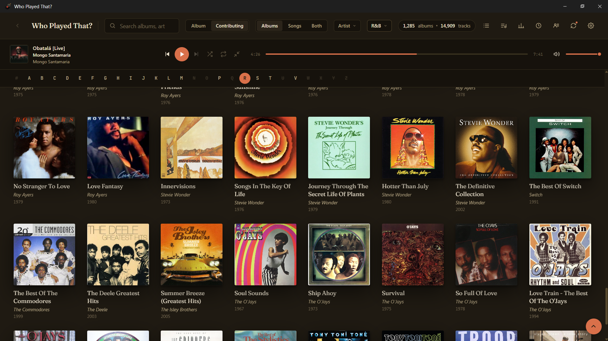
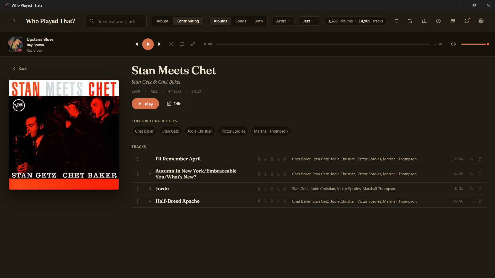
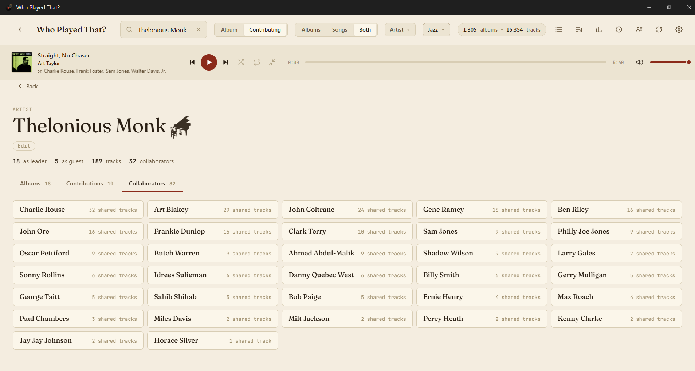
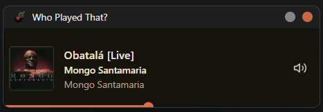

# Who Played That?

### A music player that thinks like a liner-notes reader.

**[⬇ Download latest release](https://github.com/miketaylorforhire/WhoPlayedThat-releases/releases/latest)**

---

## What it is

Point it at your music folder. It plays everything from disk — **MP3, FLAC, M4A, OGG** — and reads your ID3 multi-value artist tags the way they were meant to be read. Every sideman, composer, and session credit becomes a first-class, queueable citizen.

- **Real artist credits** — `TXXX:Artists` frames preserved; each contributing artist is its own clickable chip.
- **Collaborator drill-in** — click any sideman to see every track you have where they appear together.
- **Instant after first scan** — scans once, indexes locally, every subsequent open is instant.
- **No cloud, no account, no telemetry** — everything stays on your machine.
- **Built-in mini player** — a compact always-on-top mode that snaps to a corner.
- **Auto-updates** — quietly checks this repo on launch; updates apply through the same wizard, preserving your library.

---

## Screenshots

### Album detail — every contributor as a clickable chip

### Artist page — collaborators and shared tracks

### Mini player — always-on-top compact mode

---

## Download

**[Latest release →](https://github.com/miketaylorforhire/WhoPlayedThat-releases/releases/latest)**

Grab `Who.Played.That.Setup.exe` from the assets list, run it, and follow the wizard.

> **First-run SmartScreen warning** — the installer is not yet code-signed, so Windows will show *"Windows protected your PC"* the first time you run it. Click **More info → Run anyway**. Subsequent updates install through the wizard without prompting.

---

## Platform

Windows 10 / 11 · x64. macOS and Linux builds are not produced today.

## Auto-update

The app polls this repo's releases API on launch and offers an in-app update banner whenever a newer version is available. Updates download and apply themselves through the same installer wizard, preserving your library index and settings. Open *Tweaks → "What's new — release history"* in the app to browse every release with notes.

## Source code

The application source lives in a private repo. This public repo exists only to host release binaries so the auto-updater has an unauthenticated endpoint to poll. Issues and feature requests are not tracked here.

## License

All rights reserved.
